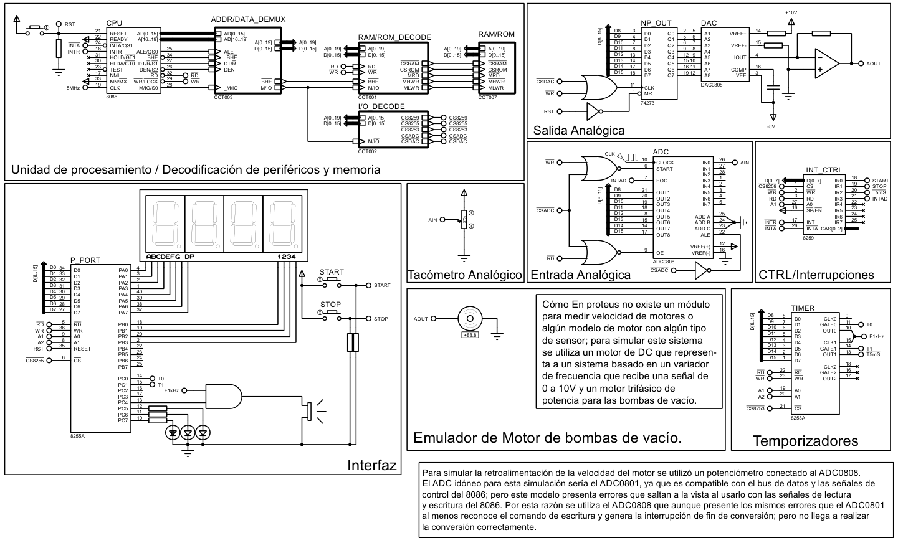

# Ejemplo 2

Se necesita diseñar un sistema de protección y control para las bombas de vacío iónicas de un equipo para tratar tumores cancerígenos en un hospital. El diseño del mismo debe contar con las siguientes características:

1. Una tecla START que encenderá las bombas y que será atendida por interrupción.
2. Un led verde que encenderá al arrancar las bombas y estará encendido mientras estén funcionando las bombas.
3. Un motor que pondrá en funcionamiento las bombas de vacío.
4. Cuatro lámparas siete-segmentos que visualizarán las revoluciones del motor.
5. Una bocina que sonará a una frecuencia de 1 KHz si las revoluciones del motor están por debajo del mínimo valor o por encima del máximo valor.
6. Un led rojo para indicar que las revoluciones del motor están por encima del valor máximo.
7. Un led amarillo para indicar que las revoluciones del motor están por debajo del valor mínimo.
8. Una tecla STOP que será atendida por interrupción y que apagará o interrumpirá el sistema descrito anteriormente.

El intervalo de revoluciones de trabajo del motor de las bombas es 800 – 1400 rpm.

____

<dezamora98@gmail.com>
